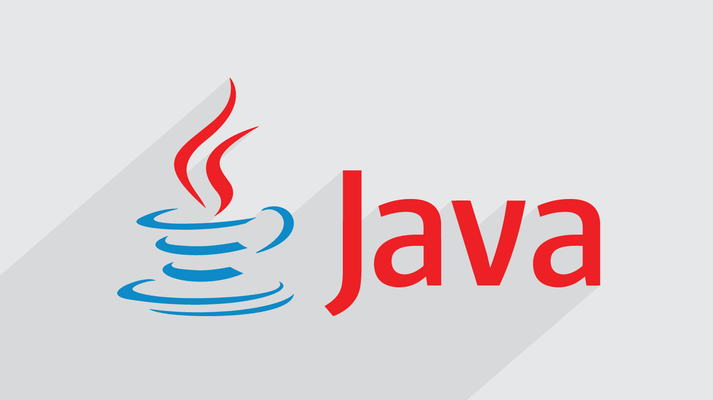

# Java

> This repository is for writing down my lessons in `Java`.

Java is a powerful programming language with great community support which can be used for many purposes and it is Object-Oriented.

## Notes

| #     | Title                                                  |
| ----- | ------------------------------------------------------ |
| `001` | [Intro](notes/Intro.md)                                |
| `002` | [Get Started](notes/GetStarted.md)                     |
| `003` | [First Java Program](notes/FirstJavaProgram.md)        |
| `004` | [Keep Things Clean](notes/KeepThingsClean.md)          |
| `005` | [Some Basic Fundaments](notes/SomeBasicFundaments.md)  |
| `006` | [Variables](notes/Variables.md)                        |
| `007` | [Operators](notes/Operators.md)                        |
